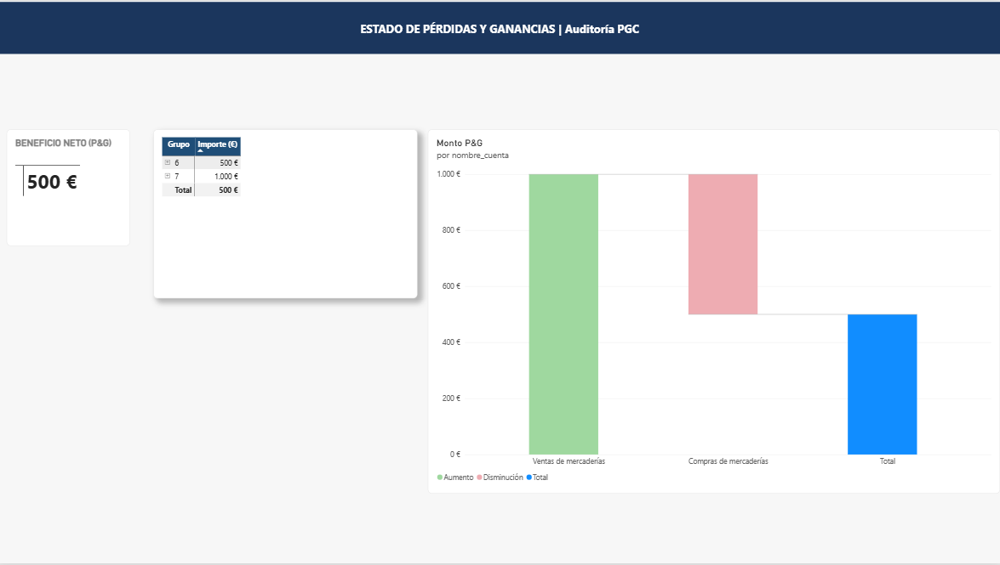
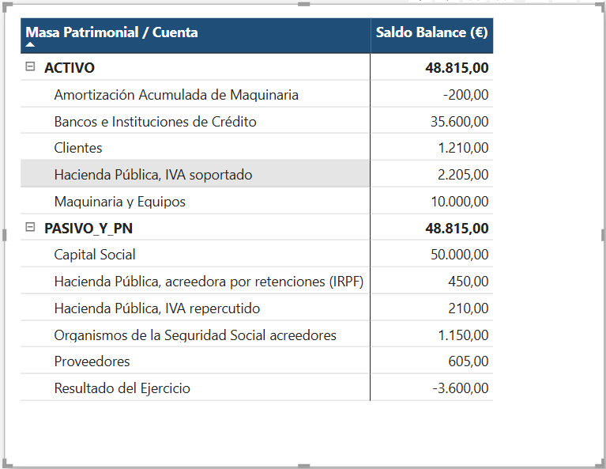

# Financial & Accounting Audit Dashboard (PostgreSQL + Power BI)

## 📌 Project Overview

This project presents an end-to-end financial data pipeline and interactive business intelligence dashboard modeled after the Spanish **Plan General Contable (PGC)**. It demonstrates robust ETL processes, relational data integrity enforcement in **PostgreSQL**, and financial reporting using **Power BI** and **DAX**.

The primary objective is to simulate an enterprise-grade Accounting Information System (AIS) capable of automated double-entry verification, quarterly VAT tax estimation (Modelo 303), and dynamic Income Statement (P&L) rendering.

---

## 🛠️ Tech Stack & Architecture

* **Database Engine:** PostgreSQL 16+
* **Database Client:** DBeaver
* **Business Intelligence & Analytics:** Power BI Desktop (VertiPaq Engine)
* **Languages:** SQL (Data Definition & Manipulation), DAX (Data Analysis Expressions)
* **Data Architecture:** Star Schema (1 Fact Table, 2 Dimension Tables)

---

## 📐 Data Model & Schema Design

The database schema is built using a strict star-schema layout to optimize analytical queries and DAX measure performance:

1. **`Diario_Contable` (Fact Table):** Contains transactional journal entries with debit/credit balance constraints (`debe >= 0 AND haber >= 0`).
2. **`Cuentas_PGC` (Dimension Table):** Hierarchical mapping of chart of accounts (Grupo, Subgrupo, Cuenta).
3. **`Terceros` (Dimension Table):** Master record of clients, vendors, and third parties.

### **Relational Schema (ERD Logic)**

```
[Cuentas_PGC] (1) ─── (N) [Diario_Contable] (N) ─── (1) [Terceros]
```

---

## ⚙️ **SQL Implementation & Audit Queries**

### **1. Data Integrity & Double-Entry Verification**

To ensure no unbalanced journal entries exist in the system, an automated audit query verifies that `SUM(debe) - SUM(haber) = 0` per journal entry ID:

```sql
SELECT 
    num_asiento AS "Asiento",
    SUM(debe) AS "Total Debe (€)",
    SUM(haber) AS "Total Haber (€)",
    (SUM(debe) - SUM(haber)) AS "Descuadre (€)"
FROM Diario_Contable
GROUP BY num_asiento
ORDER BY num_asiento;
```

### **2. Quarterly VAT Tax Settlement (Modelo 303)**

Calculates output VAT (Account 477) minus input VAT (Account 472) to determine net tax liability:

```sql
SELECT 
    SUM(CASE WHEN codigo_cuenta = '4770000' THEN haber - debe ELSE 0 END) AS "IVA Repercutido (€)",
    SUM(CASE WHEN codigo_cuenta = '4720000' THEN debe - haber ELSE 0 END) AS "IVA Soportado (€)",
    SUM(CASE WHEN codigo_cuenta = '4770000' THEN haber - debe ELSE 0 END) - 
    SUM(CASE WHEN codigo_cuenta = '4720000' THEN debe - haber ELSE 0 END) AS "Resultado Liquidación (€)"
FROM Diario_Contable;
```

---

## 📊 **Power BI Analytics & DAX Formulas**

Data is ingested via direct PostgreSQL connection using Import Mode for optimal performance.

### **Core DAX Measures**

```dax
// Total Revenues (Group 7 PGC)
Total Ingresos = 
CALCULATE(
    SUM(Diario_Contable[haber]) - SUM(Diario_Contable[debe]),
    Cuentas_PGC[grupo] = "7"
)

// Total Expenses (Group 6 PGC)
Total Gastos = 
CALCULATE(
    SUM(Diario_Contable[debe]) - SUM(Diario_Contable[haber]),
    Cuentas_PGC[grupo] = "6"
)

// Net Financial Result
Resultado del Ejercicio = [Total Ingresos] - [Total Gastos]

// Single-Column P&L Impact Measure
Monto P&G = 
VAR Ingreso = [Total Ingresos]
VAR Gasto = [Total Gastos]
RETURN
COALESCE(Ingreso, 0) - COALESCE(Gasto, 0)
```
### **Advanced Financial KPIs (Profitability & Liquidity)**

```dax
// Return on Assets (ROA)
ROA = 
VAR BeneficioNeto = [Resultado del Ejercicio]
VAR ActivoTotal = CALCULATE([Saldo Balance (€)], vw_balance_situacion[masa_patrimonial] = "ACTIVO")
RETURN DIVIDE(BeneficioNeto, ActivoTotal, 0)

// Return on Equity (ROE)
ROE = 
VAR BeneficioNeto = [Resultado del Ejercicio]
VAR PatrimonioNeto = CALCULATE([Saldo Balance (€)], vw_balance_situacion[grupo] = "1")
RETURN DIVIDE(BeneficioNeto, PatrimonioNeto, 0)

// Current Ratio (Ratio de Liquidez)
Ratio Liquidez = 
VAR ActivoCorriente = 
    CALCULATE(
        [Saldo Balance (€)], 
        vw_balance_situacion[grupo] IN {"3", "4", "5"}, 
        vw_balance_situacion[masa_patrimonial] = "ACTIVO"
    )
VAR PasivoCorriente = 
    CALCULATE(
        [Saldo Balance (€)], 
        vw_balance_situacion[grupo] IN {"4", "5"}, 
        vw_balance_situacion[masa_patrimonial] = "PASIVO_Y_PN"
    )
RETURN DIVIDE(ActivoCorriente, PasivoCorriente, 0)
```
---

## 🚀 **Key Visuals & Features**

* **Executive KPI Cards:** Instant visibility into Net Income / Loss.
* **Hierarchical P&L Matrix:** Drill-down capability from Group to individual Account levels.
* **Waterfall Chart:** Financial bridge visual tracking revenue gains against operational expenses.

### 📈 Income Statement (P&L)




### ⚖️ Balance Sheet Matrix




---

## 🚀 **How to Run Locally**

1. **Clone Repository:**

```bash
   git clone https://github.com/adrianlealmoliner-cell/financial-audit-postgres-powerbi.git
   ```

2. **Execute Database Setup:**

   * Run `scripts/01_schema.sql` in PostgreSQL via DBeaver.
   * Run `scripts/02_sample_data.sql` to populate sample accounting records.
3. **Open Power BI Dashboard:**

   * Open `reports/Financial_Dashboard.pbix`.
   * Update credentials under Data Source Settings (`localhost`, database name, username `postgres`).


## 📊 **Financial Data Architecture & Data Models**


* **PostgreSQL Layer**: Relational schema supporting full double-entry bookkeeping with dynamic foreign key references, transactional ledger (`Diario_Contable`), and automated accounting views (`vw_balance_situacion`) with year-end closing logic & (`vw_perdidas_y_ganancias`).

* **PostgreSQL Layer**: Relational schema supporting full double-entry bookkeeping with dynamic foreign key references, transactional ledger (`Diario_Contable`), and automated accounting views (`vw_balance_situacion`) with year-end closing logic & (`vw_perdidas_y_ganancias`).

